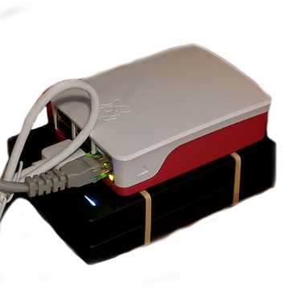

### Why am I doing this to myself?
I really like taking notes. Notes are an extension of my stupid brain, which can't remember a *damn* thing on its own. All these notes were being stored on Google's servers, which [didn't](https://en.wikipedia.org/wiki/PRISM_(surveillance_program)) [seem like](https://www.gnu.org/proprietary/malware-google.en.html) [the best](https://www.washingtonpost.com/technology/2019/06/21/google-chrome-has-become-surveillance-software-its-time-switch/) [idea](https://www.eff.org/deeplinks/2020/03/google-says-it-doesnt-sell-your-data-heres-how-company-shares-monetizes-and). And it wasn't just notes. Pictures, videos, miscellaneous files, I was giving it all to Google for free.

Since my notes contain *my bad ideas, and they are **my** bad ideas alone*, I wanted to take back control of my data. After researching ways to do such a thing (through the Google search engine of course), my best option seemed to be a [Nextcloud server](https://nextcloud.com/).

Nextcloud has all the niceties of a Google Drive or Dropbox, but you host it yourself on your own hardware, and no one's allowed to snoop. This sounded great! This'll be so easy! I'll get this running in just a couple minutes!

Maybe you guessed it from the length of this article, but... this was not the case. Building and setting up this server was a nightmare hellhole, and I'm here today to share my hell with you, the reader, for free!

This isn't so much a guide or tutorial - more just me explaining (and venting about) the massive effort it took to set this damn thing up. I hope somebody someday learns something from my suffering, or is maybe just entertained.

### The hardware
I had been interested in doing *something, anything at all*, with a [Raspberry Pi](https://www.raspberrypi.org/) for a while, so this was my excuse. Beyond that, I just followed [this great article from a Pi magazine](https://magpi.raspberrypi.org/articles/build-a-raspberry-pi-nas) for my hardware choices. If you're wondering what hardware I used, look there. I copied it exactly. Plus, c'mon, look how cute everything looks stacked up like that! A literal "stack"! Ha!

One part the guide doesn't explain very well was the "USB powered hub" - both why you need one, and what that actually is. Is it a hub powered by USB? A USB powered by a "hub"? What is a "hub"? Maybe it seems obvious to you, and maybe I was just sleep deprived at the time, but I was having trouble wrapping my smooth brain around this concept.

Turns out, the USB hub is simply needed to provide power to the two hard drives, rather than the power going to the Pi *and* the drives. I have no idea if this was really necessary, but it makes me feel 10% more confident my drives won't crap out at any moment, and that helps me go to sleep at night.

### RAID 1, or whatever that means
Here I was, all ready to go in fulfilling my long-held dream of running my own little server. Then my stupid coworker comes in, and asks "hey, what if your drive fails? what will you do then?" and ruins all of my fun. 

He tells me I should do "RAID", which is apparently all the rage. RAID stands for "Redundant, Awesome... I dunno", and was invented on a whim by [some random nerds in the 80's](https://en.wikipedia.org/wiki/RAID#History). To attempt to give an actual explanation: Using a RAID 1 setup means you get data redundancy, as it will constantly mirror the drives. If one drive craps out, the other drive still has all the same data, so you just replace the other drive and go about your day as normal. The downside of RAID 1 is you're getting half the storage capacity that you paid for, and it's a little slower... but I figured 1 terabyte was large enough to store plenty of memes.

Setting up the RAID array was by far the most pain-free part of the process. Actually, it was the *only* pain-free part, the rest was pure suffering. I recommend doing this for fun if you're bored on a Friday evening. It's cathartic, and the only part of this whole thing that [just worked](https://www.youtube.com/watch?v=nVqcxarP9J4).

All I had to do was run some cute little commands from the guide, and I was golden. I didn't fully understand the intricacies of everything I was doing, and the command-line interfaces for some of these programs were absolutely wild (press 'n' for a new partition, and 'p' for a "primary partition"? Really `fdisk`? Does this make you happy?), but other than that, it was all smooth sailing.

I should note - no one on the internet really cared to explain how a RAID setup should work with Nextcloud. Eventually I figured this out - the RAID array is seen by the OS as one device, so just politely ask Nextcloud to use that instead of the SD card. I ended up having to [create a symlink from Nextcloud's data directory to a directory on my RAID device](https://docs.nextcloud.com/server/latest/admin_manual/issues/general_troubleshooting.html#troubleshooting-data-directory), but this wasn't the worst thing I had to suffer through.

### The WiFi versus pixels battle of 2020
So here I am, all proud and happy of my brand new Raspberry Pi running a fresh ~~Raspbian~~ Raspberry Pi OS. As I was setting up the RAID array, downloading lots of cute [UNIX-style utilities](https://en.wikipedia.org/wiki/Unix_philosophy), the WiFi starts to cut in-and-out. This has been a problem on my other main machines ever since I switched them to Linux, so I figured it was the *mysterious Intel WiFi+bluetooth death bug* plaguing me on yet another machine.

I did some more digging, and found what I believe to be the truth (or, as close as *I'll* ever get to the truth). There appears to be a [widely reported problem with the Pi 4](https://www.raspberrypi.org/forums/viewtopic.php?t=247982) where the signals coming out from the HDMI (which are shaped like squares?) are the same frequency(?) as the WiFi. So, if your display resolution is pumped up high enough, and that HDMI is cranking out lots of square signals, [the WiFi gets totally borked](https://www.raspberrypi.org/forums/viewtopic.php?p=1514642&sid=b811be4b798c7ab50d7626c691b5cc26#p1514642). Neat.

This is clearly absurd, and I hate it. Hardware is bad, and everyone saying "programmers gotta learn hardware too!!!" should get off my lawn. At first I started following the internet's advice to simply "lower your screen resolution so the WiFi goes fast", but this became tiring on the eyes (especially with the added problem of [not being able to use redshift on the Pi](https://www.raspberrypi.org/forums/viewtopic.php?t=250534)).

Even though I was reluctant to at first, eventually I started controlling my Pi via an SSH terminal from my main machine. Boy oh boy, was this a joyful discovery. Not only was I freed from whatever stupid resolution the WiFi demanded, but I could also use my beloved blue-light filter to prevent my retinas from burning up. Sure, I had no GUI, but learning to do everything through the terminal came easily enough, and once I got there, I felt like some kind of computer wiz-kid.

### The installation
After the RAID was set up and I got SSH going, it was time to install Nextcloud. This proved to be shockingly difficult. There can't just be a little `sudo apt install nextcloud` action, no no no no no. You need to install each little bit yourself, by hand, and glue every piece together (`nextcloud` isn't even in the apt repository, of course you have to download / unpack something called a "tarball" yourself).

#### Attempt 1: Snap!
[Snap](https://snapcraft.io/) is Canonical's (maker of Ubuntu) locked-down little sandbox for Linux apps. The word "container" is thrown around when describing it, and I have no idea if that's correct, but I sure as heck wouldn't recommend the [official Nextcloud snap](https://snapcraft.io/nextcloud).

The major selling point of snap is that it bundles together an application's dependencies, so it will *just work* on any Linux distribution. This sounds great! Sign me up! I'm lazy and hate installing my own dependencies! Who the heck wants to do that? Shell scripts, that's who.

Problem is, this doesn't *really* work on every distro, and in fact, it doesn't work on the latest Raspberry Pi OS. Do I know why? No. The Nextcloud snap [failed silently](https://en.wikipedia.org/wiki/Fail-silent_system) before starting up, and it was too shy to tell me why. Cool.

#### Attempt 2: Some shell scripts I found
At this stage, I was still committed to being a lazy jerk. There's no way in heck I would manually install [30-something php modules](https://docs.nextcloud.com/server/latest/admin_manual/installation/source_installation.html#prerequisites-for-manual-installation) by hand. So, I found a [flashy looking site that claimed to have the scripts for me](https://ownyourbits.com/nextcloudpi/). It didn't work. The script took multiple runs to actually complete itself, and after the 5th or so attempt, it seemed happy. I went to the web GUI, told it to "initialize", and it kinda hung out there for a while. I went to take a walk, and when I came back and it was still pretending to initialize. 

I found another [official-sounding shell script](https://github.com/nextcloud/vm), in a last-ditch attempt at being lazy. At least this script had the courage to fail immediately, as it's [hardcoded to only work specifically on Ubuntu 20.04](https://github.com/nextcloud/vm/blob/master/nextcloud_install_production.sh/#L83). Would have been real nice if it had told me that up-front, but hey, I'm not the one going through the trouble of writing all these (failing) shell scripts.

#### Attempt 3: The hard way
Being lazy clearly wasn't going so well. By now several days had passed, and all I had to show for myself was a whole terabyte of nothing. Worse yet, the shell scripts I was running had spread their little tentacles all over my pure OS install, so I knew I'd have trouble in the future if I left all that cruft in-place. I decided to re-image my OS, and that I would repeat the RAID setup once I got Nextcloud going.

As previously mentioned, the [recommended installation](https://docs.nextcloud.com/server/latest/admin_manual/installation/source_installation.html) wants you to install and hook each bit up together yourself. This approach made some sense as I learned (sort of, vaguely) more about how Nextcloud works - It's running on a webserver directly on your machine, handling all the networking and whatnot, with a full-on SQL database and lots of PHP magic happening too. So, it's understandable that Nextcloud has to spread it's mischievous claws in each and every crevice of your OS.

I followed the [Nextcloud documentation](https://docs.nextcloud.com/server/latest/admin_manual/index.html), which sure does exist. In their defense, all of their software is [free and open](https://en.wikipedia.org/wiki/Free_and_open-source_software), including the docs, so I could have submitted any number of changes, and yet here I am selfishly writing this blog. The worst part of this process was the aforementioned php modules, which had to be installed one-by-one, and had mismatched names compared to the Debian repository. I had these all installed after about an hour, and I remember listening to a podcast in the background while suffering through it.

After `apt install`ing every module (seriously, why can't php have it's own package manager?!), then gliding through the initialization of Nextcloud with `occ`, my server was working. The *Nextcloud Hub* web interface greeted me with the most pleasant design and animations I had seen in quite some time. **It was over. I had won.**

### Conclusion
All in all, I sure did have a time. The admin page still won't stop whining about a "PHP memory limit". I don't even know what that means. If PHP is running out of memory, I wish it would just ask the OS for more. Really I don't mind, I've got plenty. I thought maybe they had some good reason for annoying me, but as I read more about the [haphazardous history of PHP](https://en.wikipedia.org/wiki/PHP#Early_history), I decided to change my mind. *"I have absolutely no idea how to write a programming language"*, said the writer of the PHP programming language.

Maybe my takeaway from all this is that nobody knows how to do anything. I certainly still don't, but at least I now have a functioning home server with several gigabytes of memes loaded on it.

If you're new to Linux (or bash I guess), I'm not sure I'd recommend doing any of this. I had been using Linux on my main machines for the better part of a year, and have gotten sorta okay at using the terminal. Linux makes me smile, and plopping into an SSH terminal and clacking away at the keyboard brings me joy, but it might not do the same for you. I dunno. 
